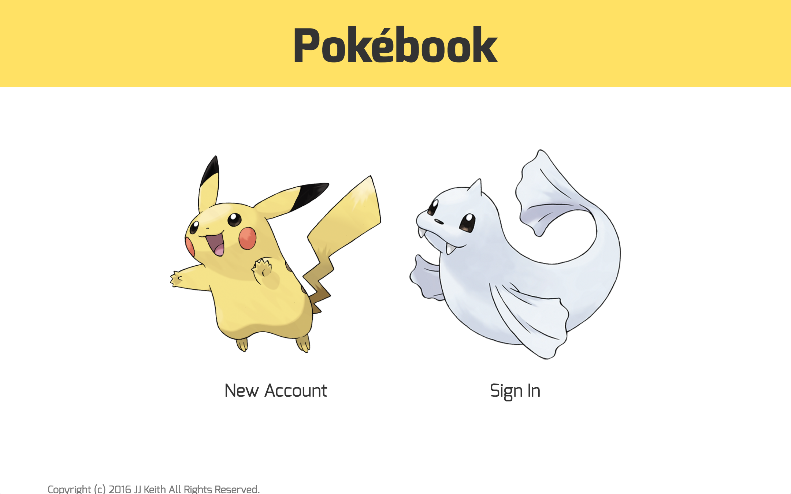
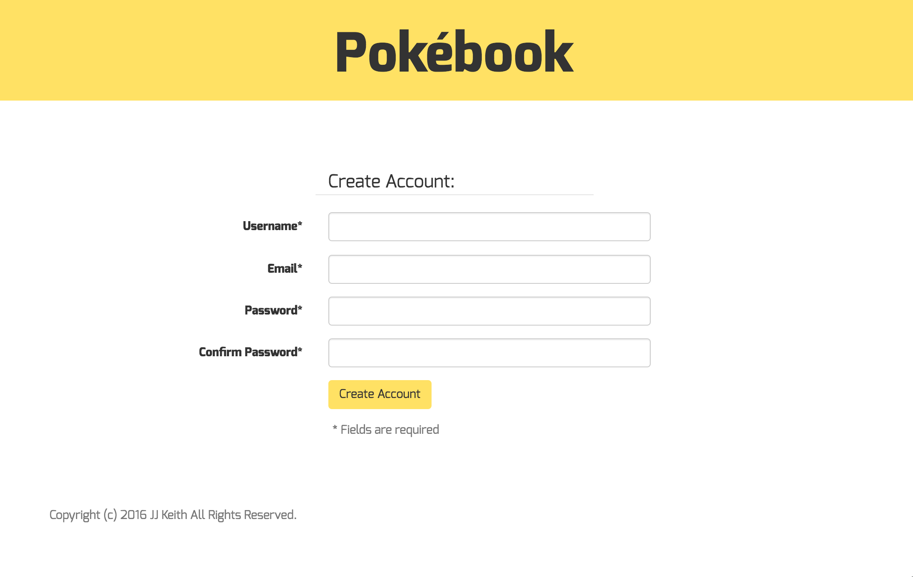
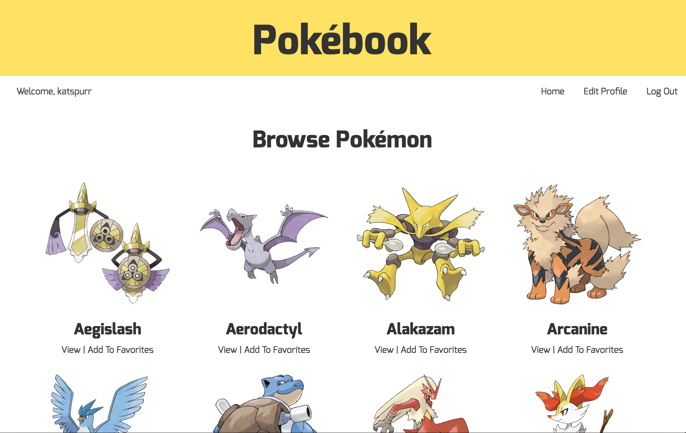
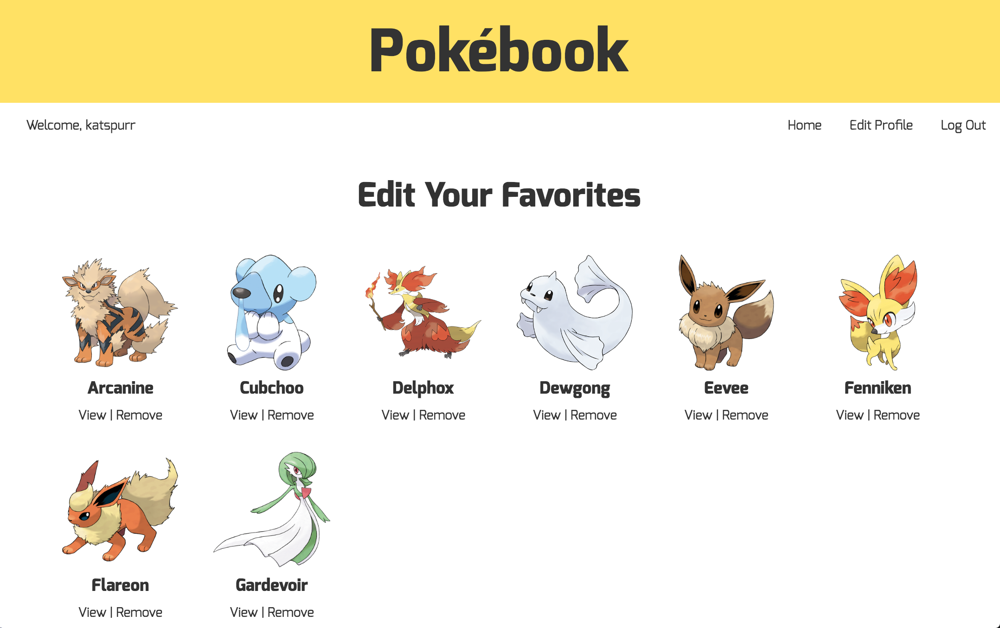
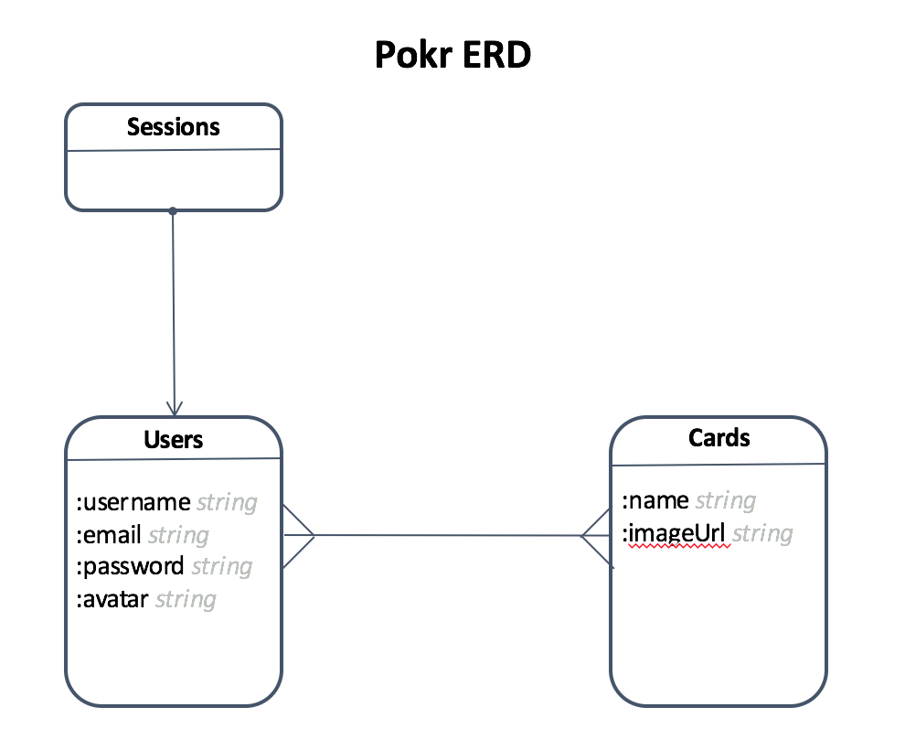
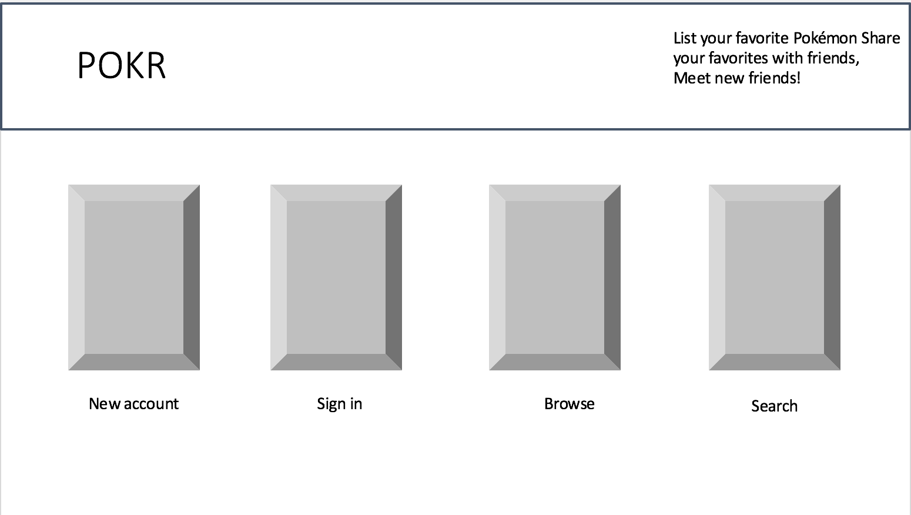
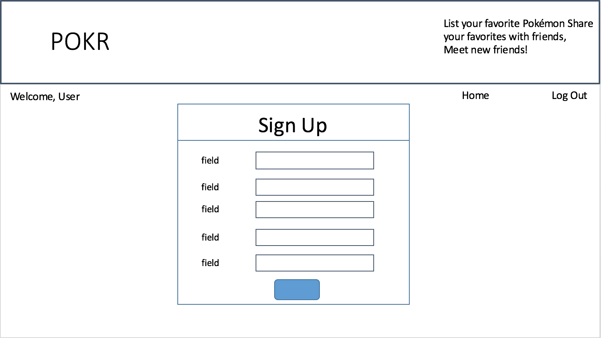
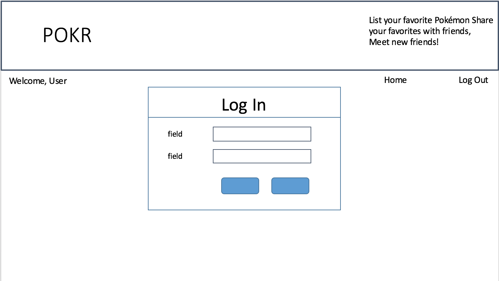
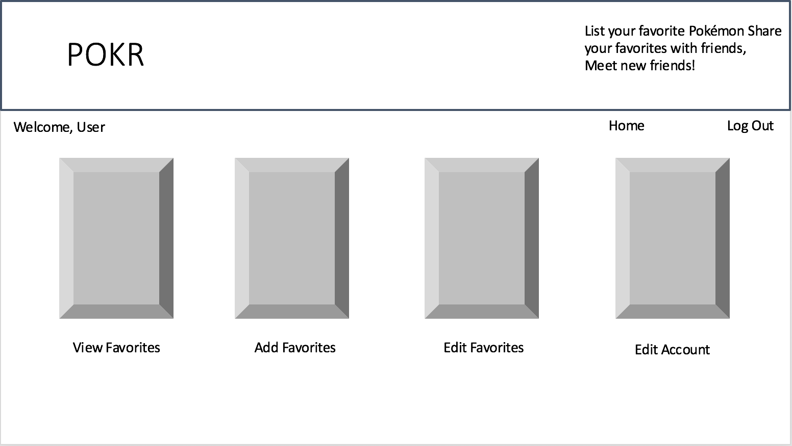
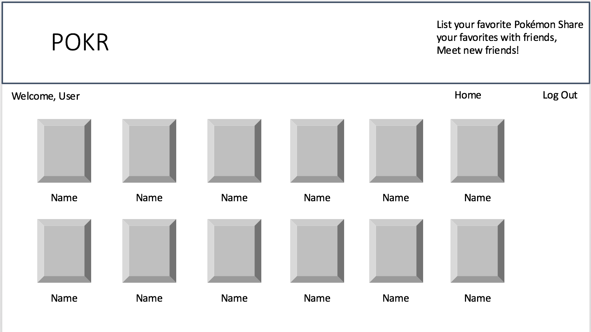

# Pokébook

http://pokemon-book.herokuapp.com

---

Pokébook users can create and maintain a list of their favorite Pokémon.

## Screenshots

## ERD

## Wireframes

## Technologies Used
- Ruby on Rails
- PostgreSQL
- jQuery
- Bootstrap
- HTML/CSS

## User Stories

| As a ... | I'd like to ... |
| ---------|-----------------|
|User|Login to my account to build a list of my favorite Pokémon characters|
|User|Add new favorite Pokémon via a form|
|User|Display a list of my favorite Pokémon|
|User|Be able to edit my profile|
|User|Remove Pokémon from my list|

## Installation

Just sign in and start using!

##Known Issues
=======
## Known Issues
* When adding a new card to favorites, a JaveScript-based alert ("Card added") would be better than redirecting back to the user_path.
* There is no filtering on the images that users add to ensure that they are of  Pokémon.
* A link to "Home" appears in the navbar on the user's "Home" page

## Future Improvements
* Add a database that contains the entire Pokédex
* Create the ability for users to "friend" one another
* Create the ability for users to share their lists
* Match users based on shared Pokémon preferences
* A board for users to schedule IRL Pokémon games
* Make the Pokémon images used in navigation links randomly rotate
